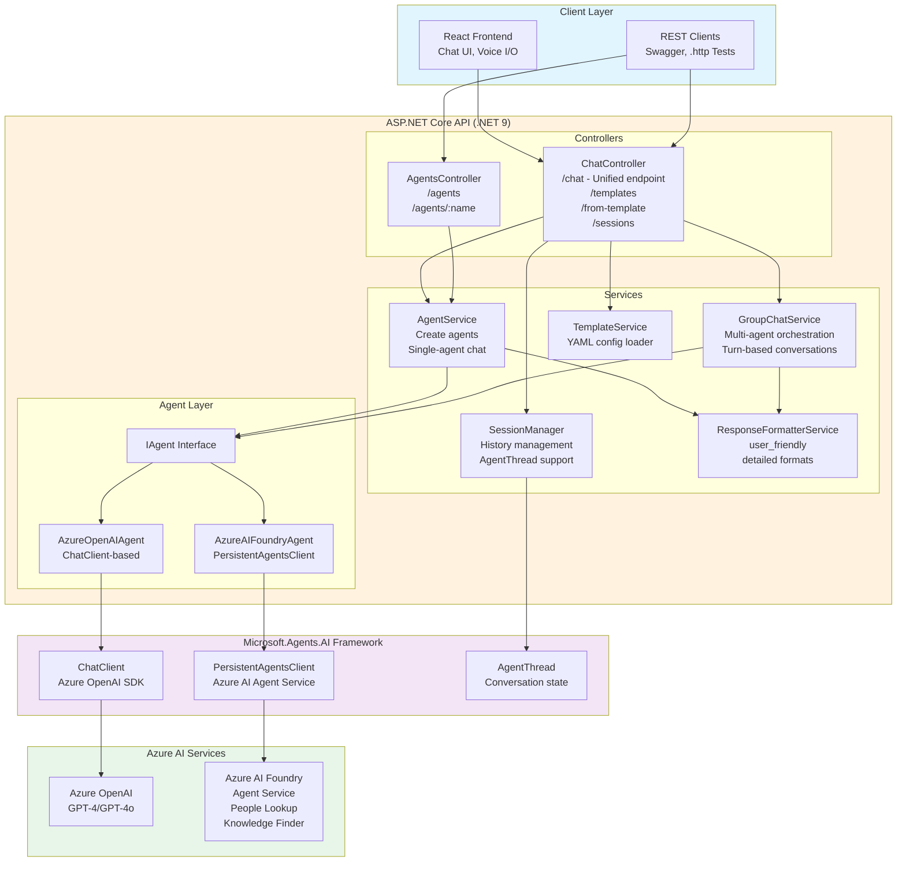
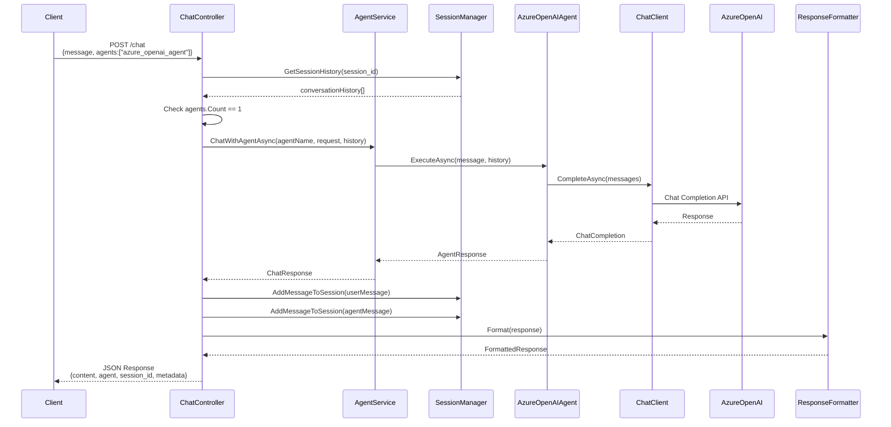
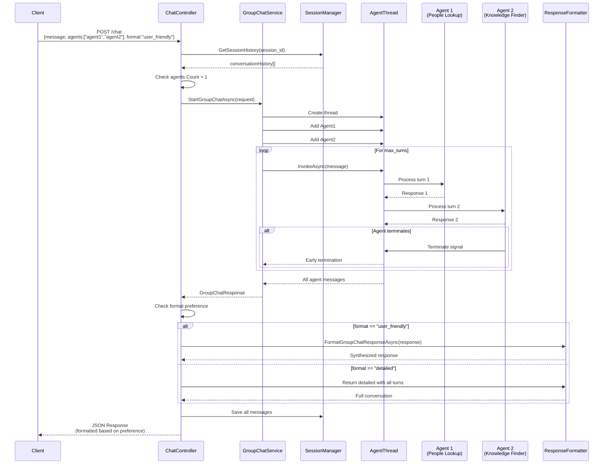
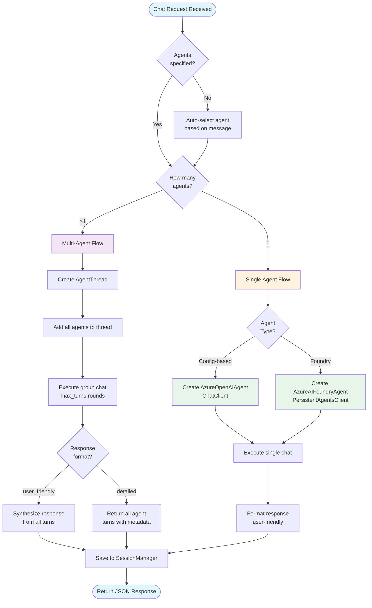
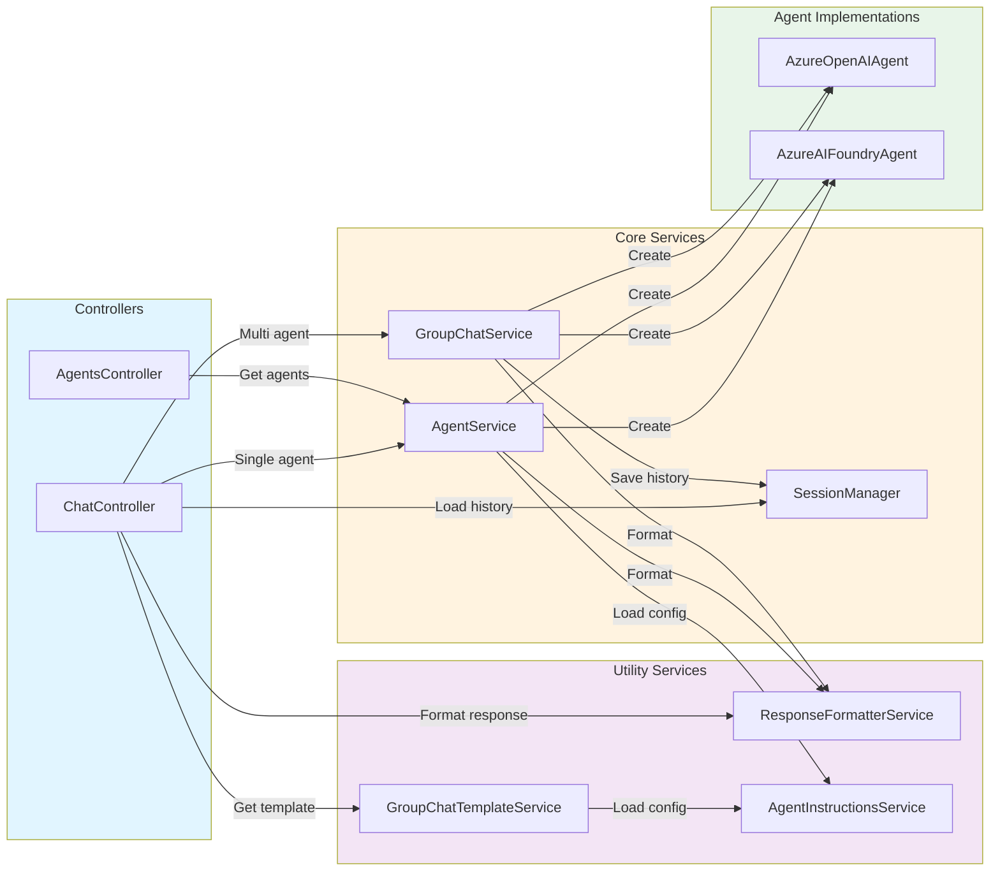
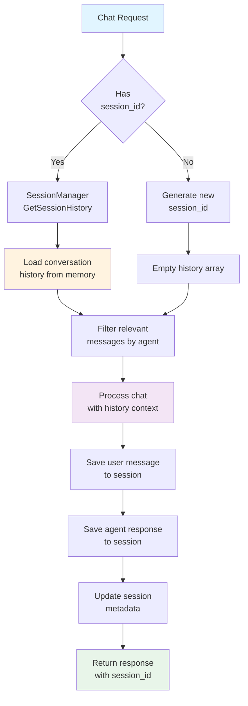
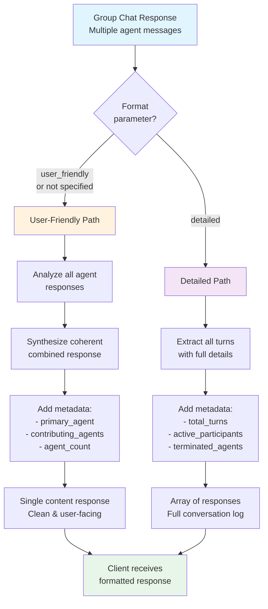
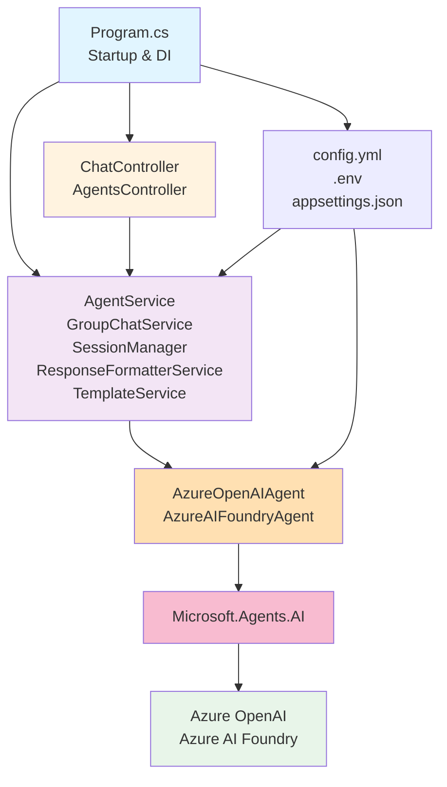

# .NET Agent Framework

A production-ready multi-agent orchestration framework built with .NET 9, ASP.NET Core, **Microsoft.Agents.AI Framework**, and Azure AI integration. This framework enables intelligent agent collaboration, conversation management, and flexible response formatting for complex AI-powered applications.

## 🌟 Features

- **Microsoft.Agents.AI Framework** - Built on Microsoft's official .NET AI agent framework with dual agent architecture
- **Unified Chat Endpoint** - Single `/chat` endpoint automatically handles both single-agent and multi-agent conversations
- **Multi-Agent Orchestration** - Coordinate multiple AI agents with intelligent turn-based conversations
- **Flexible Response Formats** - Choose between user-friendly synthesized responses or detailed conversation logs
- **Session Management** - Persistent conversation history across requests with AgentThread support
- **Agent Auto-Selection** - Automatic agent selection based on query intent when no agents specified
- **Template System** - Pre-configured chat templates for common single and multi-agent scenarios
- **Azure AI Integration** - Seamless integration with Azure AI Foundry and Azure OpenAI
- **RESTful API** - Well-documented API with Swagger UI and comprehensive .http test collection

## 🗺️ Architecture Diagrams

### High-Level System Architecture



### Request Flow - Single Agent



### Request Flow - Multi-Agent (Group Chat)



### Agent Type Decision Flow



### Service Interaction Diagram



### Data Flow - Session Management



### Response Format Transformation



### Component Dependency Graph



> **Note**: These diagrams render automatically in GitHub and VS Code (with Mermaid extension). You can also export them to PNG/SVG at [mermaid.live](https://mermaid.live) for blog posts and presentations.

## 🚀 Quick Start

### Prerequisites

- **.NET 9 SDK** - [Download](https://dotnet.microsoft.com/download/dotnet/9.0)
- **Azure OpenAI** or **Azure AI Foundry** account
- **VS Code** with REST Client extension (optional, for testing)

### Backend Setup (.NET 9 + Microsoft.Agents.AI)

1. **Navigate to backend directory:**
   ```bash
   cd Backend/dotnet
   ```

2. **Create environment file:**
   ```bash
   cp .env.template .env
   ```

3. **Configure Azure credentials in `.env`:**
   ```env
   # Azure OpenAI Configuration (Required)
   AZURE_OPENAI_ENDPOINT=https://your-resource.openai.azure.com
   AZURE_OPENAI_API_KEY=your-api-key-here
   AZURE_OPENAI_DEPLOYMENT_NAME=gpt-4o
   AZURE_OPENAI_API_VERSION=2024-10-21

   # Azure AI Foundry Configuration (Optional)
   PROJECT_ENDPOINT=https://your-project.services.ai.azure.com/api/projects/your-project
   PEOPLE_AGENT_ID=asst_xxxxx
   KNOWLEDGE_AGENT_ID=asst_xxxxx
   ```

4. **Build and run:**
   ```bash
   dotnet restore
   dotnet build
   dotnet run --urls http://localhost:8000
   ```

5. **Access the API:**
   - Swagger UI: http://localhost:8000
   - Health Check: http://localhost:8000/health
   - Agent List: http://localhost:8000/agents

## 🤖 Available Agents

| Agent | Type | Specialization | Use Cases |
|-------|------|----------------|-----------|
| **azure_openai_agent** | AzureOpenAI | General-purpose assistant | Technical questions, explanations, coding help |
| **foundry_ms_foundry_people_agent** | AzureAIFoundry | Find people and expertise | Employee search, skill matching, team discovery |
| **foundry_knowledge_finder** | AzureAIFoundry | Document and policy search | Policy questions, documentation lookup |

> **Note:** Foundry agents require Azure AI Foundry PROJECT_ENDPOINT and agent IDs. Generic agents work with Azure OpenAI only.

## 📡 API Endpoints

### Unified Chat Endpoint

The `/chat` endpoint automatically handles both single-agent and multi-agent conversations based on the `agents` array.

```http
POST /chat
Content-Type: application/json

{
  "message": "What are the best practices for .NET development?",
  "agents": ["azure_openai_agent"],              // Optional: defaults to auto-select
  "format": "user_friendly",                // Optional: "user_friendly" | "detailed"
  "session_id": "user-session-123",        // Optional: for conversation history
  "max_turns": 3                           // Optional: for multi-agent (default: 2-3)
}
```

#### Single Agent Request
```json
{
  "message": "Explain async/await in C#",
  "agents": ["azure_openai_agent"],
  "session_id": "user123"
}
```

#### Multi-Agent Request (Automatic Group Chat)
```json
{
  "message": "Who are the ML experts and what resources do we have?",
  "agents": ["foundry_ms_foundry_people_agent", "foundry_knowledge_finder"],
  "format": "detailed",
  "max_turns": 2
}
```

### Template Endpoints

```http
# Get available chat templates
GET /chat/templates

# Get specific template details
GET /chat/templates/{templateName}

# Create chat from template
POST /chat/from-template
{
  "template_name": "comprehensive_inquiry"
}

# Get active chat sessions
GET /chat/sessions
```

### Agent Management

```http
# Get all available agents
GET /agents

# Get specific agent details
GET /agents/{agentName}
```

## 📤 Response Formats

### User-Friendly Format (Default)
Synthesized, clean response optimized for end users:

```json
{
  "content": "Based on the expertise search and knowledge base, here are the ML experts...",
  "agent": "system",
  "session_id": "user123",
  "timestamp": "2024-01-15T10:30:00Z",
  "format": "user_friendly",
  "metadata": {
    "agent_count": 2,
    "primary_agent": "foundry_ms_foundry_people_agent",
    "contributing_agents": ["foundry_ms_foundry_people_agent", "foundry_knowledge_finder"],
    "is_group_chat": true,
    "total_turns": 4,
    "response_type": "user_friendly",
    "agent_framework": true
  }
}
```

### Detailed Format
Full conversation with all agent turns and metadata:

```json
{
  "conversation_id": "user123",
  "total_turns": 4,
  "active_participants": ["foundry_ms_foundry_people_agent", "foundry_knowledge_finder"],
  "responses": [
    {
      "agent": "foundry_ms_foundry_people_agent",
      "content": "I found 5 ML experts in the organization...",
      "message_id": "msg-001",
      "is_terminated": false,
      "metadata": {
        "turn": 1,
        "agent_type": "AzureAIFoundry",
        "timestamp": "2024-01-15T10:30:00Z",
        "terminated": false
      }
    },
    {
      "agent": "foundry_knowledge_finder",
      "content": "We have extensive ML documentation including...",
      "message_id": "msg-002",
      "is_terminated": true,
      "metadata": {
        "turn": 2,
        "agent_type": "AzureAIFoundry",
        "timestamp": "2024-01-15T10:30:02Z",
        "terminated": true
      }
    }
  ],
  "summary": "Combined findings from expertise search and knowledge base",
  "content": "Combined findings from expertise search and knowledge base",
  "metadata": {
    "group_chat_type": "RoundRobinGroupChat",
    "agent_count": 2,
    "agents_used": ["foundry_ms_foundry_people_agent", "foundry_knowledge_finder"],
    "max_turns_used": 2,
    "agent_framework": true,
    "early_termination": false,
    "terminated_agents": ["foundry_knowledge_finder"],
    "response_type": "detailed",
    "conversation_length": 0
  }
}
```

## ⚙️ Configuration

### Environment Variables (`.env`)

```env
# Azure OpenAI Configuration (Required)
AZURE_OPENAI_ENDPOINT=https://your-resource.openai.azure.com
AZURE_OPENAI_API_KEY=your-api-key-here
AZURE_OPENAI_DEPLOYMENT_NAME=gpt-4o
AZURE_OPENAI_API_VERSION=2024-10-21

# Azure AI Foundry Configuration (Optional)
PROJECT_ENDPOINT=https://your-project.services.ai.azure.com/api/projects/your-project
PEOPLE_AGENT_ID=asst_8tcAIexm3X8k6dQVbuQo4vRV
KNOWLEDGE_AGENT_ID=asst_pAqWN6pRcu67JqPZ4BiZis0o
MANAGED_IDENTITY_CLIENT_ID=your-managed-identity-id

# Application Settings
FRONTEND_URL=http://localhost:3001
```

### Agent Configuration (`config.yml`)

```yaml
agents:
  - name: azure_openai_agent
    model: gpt-4o
    temperature: 0.7
    max_tokens: 1500
    instructions: |
      You are a helpful AI assistant specialized in software development...

  - name: foundry_ms_foundry_people_agent
    type: foundry
    agent_id: ${PEOPLE_AGENT_ID}
    description: Finds people and expertise within the organization

  - name: foundry_knowledge_finder
    type: foundry
    agent_id: ${KNOWLEDGE_AGENT_ID}
    description: Searches documentation and knowledge base
```

## 🛠️ Development

### Project Structure

```
Backend/dotnet/
├── Controllers/
│   ├── ChatController.cs          # Unified chat endpoint (single + multi-agent)
│   └── AgentsController.cs        # Agent information endpoints
├── Services/
│   ├── AgentService.cs            # Agent creation and single-agent chat
│   ├── IAgentService.cs           # Interface
│   ├── GroupChatService.cs        # Multi-agent orchestration
│   ├── IGroupChatService.cs       # Interface
│   ├── SessionManager.cs          # Conversation history with AgentThread
│   ├── ISessionManager.cs         # Interface (implicit)
│   ├── ResponseFormatterService.cs # Format handling (user_friendly/detailed)
│   ├── IResponseFormatterService.cs # Interface (implicit)
│   ├── GroupChatTemplateService.cs # Template management
│   ├── IGroupChatTemplateService.cs # Interface
│   └── AgentInstructionsService.cs # Dynamic agent configuration
├── Agents/
│   ├── BaseAgent.cs               # IAgent, AzureOpenAIAgent, AzureAIFoundryAgent
│   └── SpecificAgents.cs          # Legacy agent implementations (deprecated)
├── Models/
│   └── ChatModels.cs              # Request/response models
├── Configuration/
│   ├── AzureAIConfig.cs           # Azure configuration models
│   └── AgentConfig.cs             # Agent configuration models
├── Program.cs                      # ASP.NET Core setup and DI
├── config.yml                      # Agent definitions
├── .env                            # Environment variables (Azure credentials)
└── DotNetAgentFramework.http      # REST Client test collection
```

### Key Services & Interfaces

| Service | Interface | Responsibility |
|---------|-----------|----------------|
| **AgentService** | IAgentService | Agent creation, single-agent chat, agent lookup |
| **GroupChatService** | IGroupChatService | Multi-agent orchestration, turn-based conversations |
| **SessionManager** | ISessionManager | Conversation history, AgentThread management |
| **ResponseFormatterService** | IResponseFormatterService | Format selection and response transformation |
| **GroupChatTemplateService** | IGroupChatTemplateService | Template loading and management |
| **AgentInstructionsService** | - | Dynamic agent instruction loading from YAML |

### Microsoft.Agents.AI Framework Components

- **`IAgent`** - Base interface for all agents
- **`AzureOpenAIAgent`** - Standard agents using ChatClient (Azure OpenAI)
- **`AzureAIFoundryAgent`** - Enterprise agents using PersistentAgentsClient (Azure AI Foundry)
- **`AgentThread`** - Stateful conversation thread management
- **`ChatClientAgent`** - Agent execution wrapper
- **`PersistentAgentsClient`** - Azure AI Foundry agent client

## 🔍 Testing

### REST Client Testing (`DotNetAgentFramework.http`)

The workspace includes comprehensive API tests:

```http
# Single agent chat
POST {{baseUrl}}/chat
{
  "message": "Explain async/await",
  "agents": ["azure_openai_agent"]
}

# Multi-agent chat (user-friendly)
POST {{baseUrl}}/chat
{
  "message": "Find ML experts and relevant docs",
  "agents": ["foundry_ms_foundry_people_agent", "foundry_knowledge_finder"],
  "format": "user_friendly"
}

# Multi-agent chat (detailed)
POST {{baseUrl}}/chat
{
  "message": "Find ML experts and relevant docs",
  "agents": ["foundry_ms_foundry_people_agent", "foundry_knowledge_finder"],
  "format": "detailed"
}

# Get templates
GET {{baseUrl}}/chat/templates

# Create from template
POST {{baseUrl}}/chat/from-template
{
  "template_name": "comprehensive_inquiry"
}

# Get active sessions
GET {{baseUrl}}/chat/sessions
```

### Swagger UI

Interactive API documentation available at: http://localhost:8000

## 📊 Performance

- **Single Agent Response**: 2-5 seconds
- **Multi-Agent (2-3 agents)**: 5-15 seconds (depends on max_turns)
- **Session Persistence**: In-memory with AgentThread support
- **Concurrent Requests**: ASP.NET Core async pipeline handles multiple users
- **Timeout Configuration**: 5-minute default for AI operations

## 🔒 Security

- HTTPS enabled in production
- CORS configured for frontend origin
- API key validation for Azure services
- Session isolation per user
- Request validation and sanitization
- Environment-based configuration

## 🚦 Best Practices

### Single Agent vs Multi-Agent

**Use Single Agent When:**
- Simple Q&A
- One domain of expertise needed
- Fast response required
- Straightforward queries

**Use Multi-Agent When:**
- Multiple perspectives needed
- Cross-domain expertise required
- Complex analysis
- Collaborative problem-solving

### Format Selection

**User-Friendly Format (Default):**
- End-user facing applications
- Clean, synthesized responses
- Production UI/UX
- Mobile apps

**Detailed Format:**
- Debugging and development
- Audit trails
- Research and analysis
- Agent behavior inspection

## 📚 Documentation

- **Swagger UI**: http://localhost:8000 - Live API documentation
- **`DotNetAgentFramework.http`**: REST Client test examples
- **Health Endpoint**: http://localhost:8000/health - System status

## 🎯 Roadmap

- [ ] Redis-backed session persistence
- [ ] Streaming responses with Server-Sent Events (SSE)
- [ ] Agent performance metrics dashboard
- [ ] Custom agent plugin system
- [ ] Advanced agent selection strategies (semantic routing)
- [ ] Conversation export/import
- [ ] Multi-language support
- [ ] Agent behavior analytics

## 🤝 Contributing

1. Fork the repository
2. Create a feature branch (`git checkout -b feature/amazing-feature`)
3. Commit your changes (`git commit -m 'Add amazing feature'`)
4. Push to the branch (`git push origin feature/amazing-feature`)
5. Open a Pull Request

## 📄 License

This project is licensed under the MIT License.

## 🙋 Support

For issues, questions, or contributions:
- **GitHub Issues**: [Create an issue](https://github.com/nhcloud/agentframework-workshop/issues)
- **Swagger UI**: http://localhost:8000 for API exploration
- **Health Check**: http://localhost:8000/health for system status

---

Built with ❤️ using .NET 9, Microsoft.Agents.AI Framework, and Azure AI