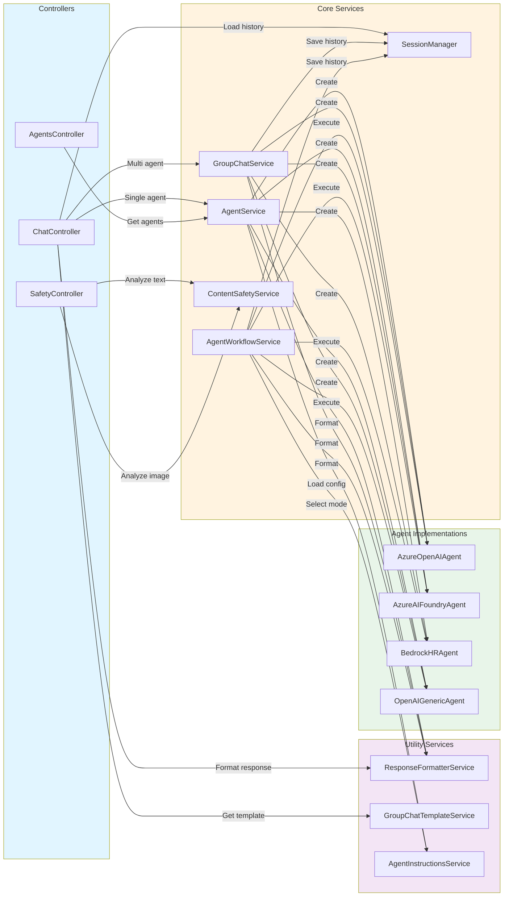

# .NET Agent Framework

A production-ready multi-agent orchestration framework built with **.NET 10**, ASP.NET Core, **Microsoft.Agents.AI Framework**, and Azure AI integration. This framework enables intelligent agent collaboration, advanced workflow orchestration, content safety, and flexible response formatting for complex AI-powered applications.

## 🌟 Features

### Core Framework
- **Microsoft.Agents.AI Framework** - Built on Microsoft's official .NET AI agent framework with multi-agent architecture
- **Multi-Provider Support** - Supports Azure OpenAI, AWS Bedrock, and OpenAI providers
- **.NET 10** - Latest .NET framework with modern C# features and performance improvements
- **Unified Chat Endpoint** - Single `/chat` endpoint automatically handles both single-agent and multi-agent conversations

### Advanced Orchestration
- **Intelligent Workflow Orchestration** - Automatic selection of orchestration modes:
  - **Single**: One agent handles the entire conversation
  - **Parallel**: Multiple agents respond simultaneously for comparative analysis
  - **Sequential**: Agents process in order with context handoff
  - **Hybrid**: Parallel first round followed by synthesis
- **Multi-Agent Coordination** - Turn-based conversations with intelligent agent selection
- **Agent Auto-Selection** - Automatic agent selection based on query intent when no agents specified
- **Early Termination** - Agents can signal completion to optimize response time

### Safety & Monitoring
- **Azure Content Safety** - Built-in content moderation with:
  - Category-specific thresholds (Hate, SelfHarm, Sexual, Violence)
  - Custom blocklists support
  - Input blocking and output filtering
  - Configurable redaction strategies
- **Application Insights Integration** - Full observability with:
  - Request/response telemetry
  - Dependency tracking
  - Distributed tracing with OpenTelemetry
  - Custom metrics and logs
  - Performance monitoring

### User Experience
- **Flexible Response Formats** - Choose between user-friendly synthesized responses or detailed conversation logs
- **Session Management** - Persistent conversation history across requests with AgentThread support
- **Template System** - Pre-configured chat templates for common single and multi-agent scenarios
- **RESTful API** - Well-documented API with Swagger UI and comprehensive .http test collection

### Configuration & Deployment
- **Environment-based Configuration** - Support for `.env`, `appsettings.json`, and YAML configuration
- **Dynamic Agent Instructions** - Load agent behavior from `config.yml`
- **CORS Support** - Configurable cross-origin resource sharing
- **Health Checks** - Built-in health monitoring endpoints

## 🗺️ Architecture Diagrams

### High-Level System Architecture


### Request Flow - Workflow Orchestration


### Request Flow - Single Agent


### Request Flow - Multi-Agent (Group Chat)


### Agent Type Decision Flow

```mermaid
flowchart TD
    Start([Chat Request Received]) --> CheckAgents{Agents<br/>specified?}
    
    CheckAgents -->|No| AutoSelect[Auto-select agent<br/>based on message]
    CheckAgents -->|Yes| CountAgents{How many<br/>agents?}
    
    AutoSelect --> CountAgents
    
    CountAgents -->|1| SingleAgent[Single Agent Flow]
    CountAgents -->|>1| SelectMode{Analyze<br/>message signals}
    
    SelectMode -->|Parallel signals| ParallelMode[Parallel Orchestration<br/>compare, analyze, options]
    SelectMode -->|Sequential signals| SequentialMode[Sequential Orchestration<br/>step, pipeline, then]
    SelectMode -->|Complex query| HybridMode[Hybrid Orchestration<br/>parallel + synthesis]
    
    SingleAgent --> CheckAgentType{Agent<br/>Type?}
    
    CheckAgentType -->|Azure OpenAI| CreateAzureOAI[Create AzureOpenAIAgent<br/>ChatClient]
    CheckAgentType -->|Foundry| CreateFoundry[Create AzureAIFoundryAgent<br/>PersistentAgentsClient]
    CheckAgentType -->|Bedrock| CreateBedrock[Create BedrockHRAgent<br/>AWS SDK]
    CheckAgentType -->|OpenAI| CreateOpenAI[Create OpenAIGenericAgent<br/>OpenAI SDK]
    
    CreateAzureOAI --> ExecuteSingle[Execute single chat]
    CreateFoundry --> ExecuteSingle
    CreateBedrock --> ExecuteSingle
    CreateOpenAI --> ExecuteSingle
    
    ExecuteSingle --> ContentSafety[Content Safety Check]
    
    ParallelMode --> ExecuteParallel[All agents respond<br/>simultaneously]
    SequentialMode --> ExecuteSequential[Agents process<br/>in order with handoff]
    HybridMode --> ExecuteHybrid[Parallel → Select best<br/>→ Synthesize]
    
    ExecuteParallel --> ContentSafety
    ExecuteSequential --> ContentSafety
    ExecuteHybrid --> ContentSafety
    
    ContentSafety --> CheckSafety{Content<br/>safe?}
    
    CheckSafety -->|Yes| FormatResponse[Format response<br/>user-friendly/detailed]
    CheckSafety -->|No| FilterContent[Filter/redact<br/>unsafe content]
    
    FilterContent --> FormatResponse
    FormatResponse --> SaveSession[Save to SessionManager]
    SaveSession --> LogTelemetry[Log to App Insights]
    LogTelemetry --> Return([Return JSON Response])
    
    style Start fill:#e1f5ff
    style Return fill:#e1f5ff
    style SingleAgent fill:#fff3e0
    style ParallelMode fill:#f3e5f5
    style SequentialMode fill:#f3e5f5
    style HybridMode fill:#f3e5f5
    style ContentSafety fill:#ffebee
    style CreateAzureOAI fill:#e8f5e9
    style CreateFoundry fill:#e8f5e9
    style CreateBedrock fill:#ffe0b2
    style CreateOpenAI fill:#e1bee7
```



### Service Interaction Diagram



### Data Flow - Session Management


### Response Format Transformation


### Component Dependency Graph


> **Note**: These diagrams render automatically in GitHub and VS Code (with Mermaid extension). You can also export them to PNG/SVG at [mermaid.live](https://mermaid.live) for blog posts and presentations.

## 🚀 Quick Start

### Prerequisites

- **.NET 10 SDK** - [Download](https://dotnet.microsoft.com/download/dotnet/10.0)
- **Azure OpenAI** or **Azure AI Foundry** account
- **Azure Content Safety** resource (optional, for content moderation)
- **Application Insights** resource (optional, for monitoring)
- **VS Code** with REST Client extension (optional, for testing)

### Backend Setup (.NET 10 + Microsoft.Agents.AI)

1. **Navigate to backend directory:**
   ```bash
   cd Backend/dotnet
   ```

2. **Create environment file:**
   ```bash
   cp .env.template .env
   ```

3. **Configure Azure credentials in `.env`:**
   ```env
   # ── Azure OpenAI Configuration (Required) ────────────────
   AZURE_OPENAI_ENDPOINT="https://your-resource.openai.azure.com"
   AZURE_OPENAI_API_KEY="your-api-key-here"
   AZURE_OPENAI_DEPLOYMENT_NAME="gpt-4o"
   AZURE_OPENAI_API_VERSION="2024-10-21"

   # ── Agent Settings ────────────────────────────────────
   ENABLE_LONG_RUNNING_MEMORY="true"

   # ── Microsoft Foundry (Optional) ────────────────────────
   MS_FOUNDRY_PROJECT_ENDPOINT="https://your-project.services.ai.azure.com/api/projects/your-project"
   MS_FOUNDRY_AGENT_ID="asst_xxxxx"
   MANAGED_IDENTITY_CLIENT_ID=""

   # ── Application Insights (Optional) ─────────────────────
   APPLICATIONINSIGHTS_CONNECTION_STRING="InstrumentationKey=...;IngestionEndpoint=..."

   # ── Azure Content Safety (Optional) ────────────────────
   CONTENT_SAFETY_ENDPOINT="https://your-resource.cognitiveservices.azure.com/"
   CONTENT_SAFETY_API_KEY="your-content-safety-key"
   CONTENT_SAFETY_ENABLED="true"
   CONTENT_SAFETY_SEVERITY_THRESHOLD="4"
   CONTENT_SAFETY_THRESHOLD_HATE="4"
   CONTENT_SAFETY_THRESHOLD_SELFHARM="4"
   CONTENT_SAFETY_THRESHOLD_SEXUAL="4"
   CONTENT_SAFETY_THRESHOLD_VIOLENCE="4"
   CONTENT_SAFETY_BLOCK_UNSAFE_INPUT="true"
   CONTENT_SAFETY_FILTER_UNSAFE_OUTPUT="true"
   CONTENT_SAFETY_BLOCKLISTS="myblocklist"
   CONTENT_SAFETY_OUTPUT_ACTION="redact"
   CONTENT_SAFETY_PLACEHOLDER_TEXT="[Content removed due to safety policy]"

   # ── Application Configuration ────────────────────────────
   FRONTEND_URL="http://localhost:3001"

   # ── AWS Configuration (Optional) ────────────────────────
   AWS_ACCESS_KEY_ID="your-access-key"
   AWS_SECRET_ACCESS_KEY="your-secret-key"
   AWS_REGION="us-east-1"
   AWS_BEDROCK_MODEL_ID="amazon.nova-pro-v1:0"
   AWS_BEDROCK_AGENT_ID="your-agent-id"

   # ── OpenAI (Optional) ────────────────────────────────────
   OPENAI_API_KEY="sk-proj-..."
   OPENAI_MODEL_ID="gpt-4o"
   ```

4. **Build and run:**
   ```bash
   dotnet restore
   dotnet build
   dotnet run --urls http://localhost:8000
   ```

5. **Access the API:**
   - Swagger UI: http://localhost:8000
   - Health Check: http://localhost:8000/health
   - Agent List: http://localhost:8000/agents

## 🤖 Available Agents

| Agent | Type | Provider | Specialization | Use Cases |
|-------|------|----------|----------------|-----------|
| **azure_openai_agent** | AzureOpenAI | Azure | General-purpose assistant | Technical questions, explanations, coding help |
| **ms_foundry_people_agent** | AzureAIFoundry | Azure | Find people and expertise | Employee search, skill matching, team discovery |
| **foundry_knowledge_finder** | AzureAIFoundry | Azure | Document and policy search | Policy questions, documentation lookup |
| **bedrock_agent** | Bedrock | AWS | HR and workplace policies | Benefits, time off, company policies |
| **openai_agent** | OpenAI | OpenAI | Development and technical | Software dev, debugging, architecture |

> **Note:** 
> - Azure Foundry agents require `MS_FOUNDRY_PROJECT_ENDPOINT` and agent IDs
> - AWS Bedrock agents require AWS credentials and configuration
> - OpenAI agents require `OPENAI_API_KEY`
> - Azure OpenAI agents work with `AZURE_OPENAI_*` configuration

## 📡 API Endpoints

### Unified Chat Endpoint

The `/chat` endpoint automatically handles both single-agent and multi-agent conversations based on the `agents` array.

```http
POST /chat
Content-Type: application/json

{
  "message": "What are the best practices for .NET development?",
  "agents": ["azure_openai_agent"],              // Optional: defaults to auto-select
  "format": "user_friendly",                // Optional: "user_friendly" | "detailed"
  "session_id": "user-session-123",        // Optional: for conversation history
  "max_turns": 3                           // Optional: for multi-agent (default: 2-3)
}
```

#### Single Agent Request
```json
{
  "message": "Explain async/await in C#",
  "agents": ["azure_openai_agent"],
  "session_id": "user123"
}
```

#### Multi-Agent Request (Automatic Group Chat)
```json
{
  "message": "Who are the ML experts and what resources do we have?",
  "agents": ["foundry_ms_foundry_people_agent", "foundry_knowledge_finder"],
  "format": "detailed",
  "max_turns": 2
}
```

### Template Endpoints

```http
# Get available chat templates
GET /chat/templates

# Get specific template details
GET /chat/templates/{templateName}

# Create chat from template
POST /chat/from-template
{
  "template_name": "comprehensive_inquiry"
}

# Get active chat sessions
GET /chat/sessions
```

### Agent Management

```http
# Get all available agents
GET /agents

# Get specific agent details
GET /agents/{agentName}
```

## 📤 Response Formats

### User-Friendly Format (Default)
Synthesized, clean response optimized for end users:

```json
{
  "content": "Based on the expertise search and knowledge base, here are the ML experts...",
  "agent": "system",
  "session_id": "user123",
  "timestamp": "2024-01-15T10:30:00Z",
  "format": "user_friendly",
  "metadata": {
    "agent_count": 2,
    "primary_agent": "foundry_ms_foundry_people_agent",
    "contributing_agents": ["foundry_ms_foundry_people_agent", "foundry_knowledge_finder"],
    "is_group_chat": true,
    "total_turns": 4,
    "response_type": "user_friendly",
    "agent_framework": true
  }
}
```

### Detailed Format
Full conversation with all agent turns and metadata:

```json
{
  "conversation_id": "user123",
  "total_turns": 4,
  "active_participants": ["foundry_ms_foundry_people_agent", "foundry_knowledge_finder"],
  "responses": [
    {
      "agent": "foundry_ms_foundry_people_agent",
      "content": "I found 5 ML experts in the organization...",
      "message_id": "msg-001",
      "is_terminated": false,
      "metadata": {
        "turn": 1,
        "agent_type": "AzureAIFoundry",
        "timestamp": "2024-01-15T10:30:00Z",
        "terminated": false
      }
    },
    {
      "agent": "foundry_knowledge_finder",
      "content": "We have extensive ML documentation including...",
      "message_id": "msg-002",
      "is_terminated": true,
      "metadata": {
        "turn": 2,
        "agent_type": "AzureAIFoundry",
        "timestamp": "2024-01-15T10:30:02Z",
        "terminated": true
      }
    }
  ],
  "summary": "Combined findings from expertise search and knowledge base",
  "content": "Combined findings from expertise search and knowledge base",
  "metadata": {
    "group_chat_type": "RoundRobinGroupChat",
    "agent_count": 2,
    "agents_used": ["foundry_ms_foundry_people_agent", "foundry_knowledge_finder"],
    "max_turns_used": 2,
    "agent_framework": true,
    "early_termination": false,
    "terminated_agents": ["foundry_knowledge_finder"],
    "response_type": "detailed",
    "conversation_length": 0
  }
}
```

## ⚙️ Configuration

### Environment Variables (`.env`)

The application supports multiple configuration sources with the following priority:
1. Environment variables (`.env` file)
2. `appsettings.json` / `appsettings.Development.json`
3. `config.yml` (for agent instructions)

#### Required Configuration

```env
# Azure OpenAI (Required for azure_openai_agent)
AZURE_OPENAI_ENDPOINT="https://your-resource.openai.azure.com"
AZURE_OPENAI_API_KEY="your-api-key-here"
AZURE_OPENAI_DEPLOYMENT_NAME="gpt-4o"
AZURE_OPENAI_API_VERSION="2024-10-21"
```

#### Optional Configuration

```env
# Microsoft Foundry
MS_FOUNDRY_PROJECT_ENDPOINT="https://your-project.services.ai.azure.com/api/projects/your-project"
MS_FOUNDRY_AGENT_ID="asst_xxxxx"
MANAGED_IDENTITY_CLIENT_ID="your-managed-identity-id"

# Azure Content Safety
CONTENT_SAFETY_ENDPOINT="https://your-resource.cognitiveservices.azure.com/"
CONTENT_SAFETY_API_KEY="your-content-safety-key"
CONTENT_SAFETY_ENABLED="true"
CONTENT_SAFETY_SEVERITY_THRESHOLD="4"  # Global threshold (0-7)
CONTENT_SAFETY_THRESHOLD_HATE="4"      # -1 to disable category
CONTENT_SAFETY_THRESHOLD_SELFHARM="4"
CONTENT_SAFETY_THRESHOLD_SEXUAL="4"
CONTENT_SAFETY_THRESHOLD_VIOLENCE="4"
CONTENT_SAFETY_BLOCK_UNSAFE_INPUT="true"
CONTENT_SAFETY_FILTER_UNSAFE_OUTPUT="true"
CONTENT_SAFETY_BLOCKLISTS="myblocklist1,myblocklist2"
CONTENT_SAFETY_OUTPUT_ACTION="redact"  # redact | placeholder | empty
CONTENT_SAFETY_PLACEHOLDER_TEXT="[Content removed due to safety policy]"

# Application Insights
APPLICATIONINSIGHTS_CONNECTION_STRING="InstrumentationKey=...;IngestionEndpoint=...;LiveEndpoint=...;ApplicationId=..."

# AWS Bedrock
AWS_ACCESS_KEY_ID="your-access-key"
AWS_SECRET_ACCESS_KEY="your-secret-key"
AWS_REGION="us-east-1"
AWS_BEDROCK_MODEL_ID="amazon.nova-pro-v1:0"
AWS_BEDROCK_AGENT_ID="your-agent-id"

# OpenAI
OPENAI_API_KEY="sk-proj-..."
OPENAI_MODEL_ID="gpt-4o"

# Application Settings
FRONTEND_URL="http://localhost:3001"
ENABLE_LONG_RUNNING_MEMORY="true"
```

### Agent Configuration (`config.yml`)

Define agent behavior and instructions:

```yaml
# .NET Agent Framework Configuration

app:
  title: ".NET Agent Framework AI Agent System"
  version: "2.0.0"
  frontend_url: "${FRONTEND_URL:*}"
  log_level: "${LOG_LEVEL:Information}"
  environment: "${ENVIRONMENT:Production}"

azure_openai:
  endpoint: "${AZURE_OPENAI_ENDPOINT}"
  deployment: "${AZURE_OPENAI_DEPLOYMENT_NAME}"
  api_key: "${AZURE_OPENAI_API_KEY}"
  api_version: "${AZURE_OPENAI_API_VERSION:2024-02-01}"

ms_foundry:
  project_endpoint: "${MS_FOUNDRY_PROJECT_ENDPOINT}"
  agent_id: "${MS_FOUNDRY_AGENT_ID}"

agents:
  azure_openai_agent:
    enabled: true
    instructions: |
      You are a helpful, knowledgeable, and versatile assistant powered by Azure OpenAI.
      Provide clear, accurate, and helpful responses across various domains.
    metadata:
      description: "General-purpose conversational agent powered by Azure OpenAI"

  ms_foundry_people_agent:
    enabled: true
    instructions: |
      You are a People Lookup Agent expert at finding information about people, contacts, and team members.
      Base answers on verified directory information.
    metadata:
      description: "Specialized agent for finding people information using Microsoft Foundry"

  bedrock_agent:
    enabled: true
    instructions: |
      You are an HR and workplace policy assistant running on AWS Bedrock.
      Help employees with company policies, benefits, time off, and general HR guidance.
    metadata:
      description: "HR and workplace policy assistant powered by AWS Bedrock"

  openai_agent:
    enabled: true
    instructions: |
      You are a helpful assistant running on OpenAI's GPT-4.1 model.
      Specialize in software development, architecture, debugging, and technical explanation.
    metadata:
      description: "Direct OpenAI assistant for development and technical help"
```

### Application Settings (`appsettings.Development.json`)

Configure logging and development-specific settings:

```json
{
  "Logging": {
    "LogLevel": {
      "Default": "Information",
      "Microsoft.AspNetCore": "Warning",
      "Microsoft.Extensions.Http": "Information"
    },
    "ApplicationInsights": {
      "LogLevel": {
        "Default": "Information",
        "Microsoft.AspNetCore": "Warning"
      }
    },
    "Console": {
      "IncludeScopes": true
    }
  },
  "AllowedHosts": "*",
  "FRONTEND_URL": "http://localhost:3001",
  "DetailedErrors": true
}
```

## 🛠️ Development

### Project Structure

```
Backend/dotnet/
├── Controllers/
│   ├── ChatController.cs          # Unified chat endpoint (single + multi-agent)
│   ├── AgentsController.cs        # Agent information endpoints
│   └── SafetyController.cs        # Content safety endpoints
├── Services/
│   ├── AgentService.cs            # Agent creation and single-agent chat
│   ├── IAgentService.cs           # Interface
│   ├── GroupChatService.cs        # Multi-agent orchestration
│   ├── IGroupChatService.cs       # Interface
│   ├── AgentWorkflowService.cs    # Intelligent workflow orchestration
│   ├── IAgentWorkflowService.cs   # Interface
│   ├── ContentSafetyService.cs    # Content moderation service
│   ├── IContentSafetyService.cs   # Interface
│   ├── SessionManager.cs          # Conversation history with AgentThread
│   ├── ISessionManager.cs         # Interface
│   ├── ResponseFormatterService.cs # Format handling (user_friendly/detailed)
│   ├── IResponseFormatterService.cs # Interface
│   ├── GroupChatTemplateService.cs # Template management
│   ├── IGroupChatTemplateService.cs # Interface
│   └── AgentInstructionsService.cs # Dynamic agent configuration
├── Agents/
│   ├── BaseAgent.cs               # IAgent interface
│   ├── AzureOpenAIGenericAgent.cs # Azure OpenAI agent
│   ├── MicrosoftFoundryPeopleAgent.cs # Azure AI Foundry agent
│   ├── BedrockHRAgent.cs          # AWS Bedrock agent
│   ├── OpenAIGenericAgent.cs      # OpenAI agent
│   ├── UserInfoMemory.cs          # Long-running memory support
│   └── Tools/
│       └── WeatherTool.cs         # Example tool implementation
├── Models/
│   └── ChatModels.cs              # Request/response models
├── Configuration/
│   ├── AzureAIConfig.cs           # Azure configuration models
│   └── AgentConfig.cs             # Agent configuration models
├── Program.cs                      # ASP.NET Core setup, DI, telemetry
├── config.yml                      # Agent definitions and instructions
├── .env                            # Environment variables (Azure credentials)
├── appsettings.json                # Application settings
├── appsettings.Development.json    # Development settings
├── DotNetAgentFramework.csproj     # Project file with dependencies
├── DotNetAgentFramework.http       # REST Client test collection
└── GlobalUsings.cs                 # Global using directives
```

### Key Services & Interfaces

| Service | Interface | Responsibility |
|---------|-----------|----------------|
| **AgentService** | IAgentService | Agent creation, single-agent chat, agent lookup |
| **GroupChatService** | IGroupChatService | Multi-agent orchestration, turn-based conversations |
| **AgentWorkflowService** | IAgentWorkflowService | Intelligent orchestration with mode selection |
| **ContentSafetyService** | IContentSafetyService | Content moderation, input validation, output filtering |
| **SessionManager** | ISessionManager | Conversation history, AgentThread management |
| **ResponseFormatterService** | IResponseFormatterService | Format selection and response transformation |
| **GroupChatTemplateService** | IGroupChatTemplateService | Template loading and management |
| **AgentInstructionsService** | - | Dynamic agent instruction loading from YAML |

### Microsoft.Agents.AI Framework Components

- **`IAgent`** - Base interface for all agents
- **`ChatClientAgent`** - Agent wrapper for Azure OpenAI ChatClient
- **`PersistentAgentsClient`** - Azure AI Foundry agent client
- **`AgentThread`** - Stateful conversation thread management
- **`Workflow`** - Orchestration and routing logic
- **`UserInfoMemory`** - Long-running memory support

### NuGet Package Dependencies

Key packages used in this project (see `DotNetAgentFramework.csproj` for complete list):

```xml
<!-- Microsoft Agents AI Framework -->
<PackageReference Include="Microsoft.Agents.AI" Version="1.0.0-preview.251125.1" />
<PackageReference Include="Microsoft.Agents.AI.Abstractions" Version="1.0.0-preview.251125.1" />
<PackageReference Include="Microsoft.Agents.AI.AzureAI" Version="1.0.0-preview.251125.1" />
<PackageReference Include="Microsoft.Agents.AI.OpenAI" Version="1.0.0-preview.251125.1" />
<PackageReference Include="Microsoft.Agents.AI.Workflows" Version="1.0.0-preview.251125.1" />

<!-- Azure AI Services -->
<PackageReference Include="Azure.AI.OpenAI" Version="2.7.0-beta.1" />
<PackageReference Include="Azure.AI.Agents.Persistent" Version="1.2.0-beta.7" />
<PackageReference Include="Azure.AI.ContentSafety" Version="1.0.0" />
<PackageReference Include="Azure.Identity" Version="1.18.0-beta.2" />

<!-- AWS Integration -->
<PackageReference Include="AWSSDK.Extensions.Bedrock.MEAI" Version="4.0.4.10" />

<!-- OpenAI -->
<PackageReference Include="OpenAI" Version="2.7.0" />
<PackageReference Include="Microsoft.Extensions.AI.OpenAI" Version="10.1.0-preview.1.25608.1" />

<!-- Monitoring & Telemetry -->
<PackageReference Include="Microsoft.ApplicationInsights.AspNetCore" Version="2.22.0" />
<PackageReference Include="Azure.Monitor.OpenTelemetry.Exporter" Version="1.4.0" />
<PackageReference Include="OpenTelemetry" Version="1.12.0" />
<PackageReference Include="OpenTelemetry.Instrumentation.AspNetCore" Version="1.12.0" />
<PackageReference Include="OpenTelemetry.Instrumentation.Http" Version="1.12.0" />

<!-- Configuration & Web API -->
<PackageReference Include="NetEscapades.Configuration.Yaml" Version="3.1.0" />
<PackageReference Include="DotNetEnv" Version="3.1.1" />
<PackageReference Include="Swashbuckle.AspNetCore" Version="10.0.1" />
```

## 🔒 Security & Content Safety

### Content Safety Features

The framework includes comprehensive content safety features powered by Azure Content Safety:

#### Input Validation
- **Automatic blocking** of unsafe user input before processing
- **Category-specific thresholds** for Hate, SelfHarm, Sexual, and Violence
- **Custom blocklists** for domain-specific content filtering
- **Real-time analysis** with configurable severity levels (0-7)

#### Output Filtering
- **Automatic filtering** of unsafe agent responses
- **Configurable actions**:
  - `redact`: Replace unsafe content with safety message
  - `placeholder`: Use custom placeholder text
  - `empty`: Return empty response
- **Granular control** per content category

#### Configuration

```env
# Enable/disable content safety
CONTENT_SAFETY_ENABLED="true"

# Global severity threshold (0-7, where 7 is most severe)
CONTENT_SAFETY_SEVERITY_THRESHOLD="4"

# Category-specific thresholds (-1 to disable)
CONTENT_SAFETY_THRESHOLD_HATE="4"
CONTENT_SAFETY_THRESHOLD_SELFHARM="4"
CONTENT_SAFETY_THRESHOLD_SEXUAL="4"
CONTENT_SAFETY_THRESHOLD_VIOLENCE="4"

# Safety actions
CONTENT_SAFETY_BLOCK_UNSAFE_INPUT="true"
CONTENT_SAFETY_FILTER_UNSAFE_OUTPUT="true"

# Custom blocklists (comma-separated)
CONTENT_SAFETY_BLOCKLISTS="myblocklist1,myblocklist2"

# Output filtering behavior
CONTENT_SAFETY_OUTPUT_ACTION="redact"  # redact | placeholder | empty
CONTENT_SAFETY_PLACEHOLDER_TEXT="[Content removed due to safety policy]"
```

#### API Endpoints

```http
# Analyze text content
POST /safety/analyze-text
{
  "text": "Content to analyze"
}

# Analyze image content
POST /safety/analyze-image
Content-Type: multipart/form-data
[image file]
```

### Security Best Practices

- **HTTPS enabled** in production
- **CORS configured** for frontend origin
- **API key validation** for all Azure services
- **Session isolation** per user
- **Request validation** and sanitization
- **Environment-based configuration** (secrets in `.env`, not in code)
- **Managed Identity support** for Azure AI Foundry

## 📊 Performance & Monitoring

### Application Insights Integration

Full observability with Azure Application Insights:

#### Telemetry Collected
- **Request telemetry**: All HTTP requests with duration and status
- **Dependency tracking**: External API calls (Azure OpenAI, AWS Bedrock, etc.)
- **Exception tracking**: Unhandled exceptions and errors
- **Custom events**: Agent invocations, workflow mode selections
- **Performance counters**: CPU, memory, request rates
- **Distributed tracing**: End-to-end request correlation

#### OpenTelemetry Support
- **Distributed tracing** across services
- **HTTP client instrumentation**
- **ASP.NET Core instrumentation**
- **Console exporter** for local debugging
- **Azure Monitor exporter** for production

#### Configuration

```env
# Application Insights connection string
APPLICATIONINSIGHTS_CONNECTION_STRING="InstrumentationKey=...;IngestionEndpoint=...;LiveEndpoint=...;ApplicationId=..."
```

#### Logging Configuration

```json
{
  "Logging": {
    "LogLevel": {
      "Default": "Information",
      "Microsoft.AspNetCore": "Warning",
      "Microsoft.Extensions.Http": "Information"
    },
    "ApplicationInsights": {
      "LogLevel": {
        "Default": "Information"
      }
    },
    "Console": {
      "IncludeScopes": true
    }
  }
}
```

### Performance Metrics

- **Single Agent Response**: 2-5 seconds
- **Multi-Agent Parallel**: 3-8 seconds (concurrent execution)
- **Multi-Agent Sequential**: 5-15 seconds (depends on agent count)
- **Multi-Agent Hybrid**: 8-20 seconds (parallel + synthesis)
- **Workflow Orchestration Overhead**: <500ms
- **Content Safety Analysis**: <1 second
- **Session Persistence**: In-memory with AgentThread (sub-millisecond)
- **Concurrent Requests**: Handles 100+ concurrent users (ASP.NET Core async)
- **Request Timeout**: 5 minutes for AI operations

## 🎯 Roadmap

### Planned Features
- [ ] **Redis-backed session persistence** for distributed deployment
- [ ] **Streaming responses** with Server-Sent Events (SSE)
- [ ] **Agent performance metrics dashboard** in Application Insights
- [ ] **Custom agent plugin system** for extensibility
- [ ] **Advanced agent selection** with semantic routing
- [ ] **Conversation export/import** for backup and migration
- [ ] **Multi-language support** for global deployments
- [ ] **Agent behavior analytics** and insights
- [ ] **Rate limiting and throttling** for API protection
- [ ] **Webhook support** for async notifications
- [ ] **GraphQL API** alongside REST
- [ ] **gRPC support** for high-performance scenarios

### Under Consideration
- [ ] **Vector database integration** (Azure AI Search, Pinecone)
- [ ] **Function calling support** for agents
- [ ] **Multi-modal support** (vision, audio)
- [ ] **Agent training and fine-tuning** workflows
- [ ] **A/B testing framework** for agent optimization
- [ ] **Cost tracking and optimization** per agent/conversation

## 🤝 Contributing

1. Fork the repository
2. Create a feature branch (`git checkout -b feature/amazing-feature`)
3. Commit your changes (`git commit -m 'Add amazing feature'`)
4. Push to the branch (`git push origin feature/amazing-feature`)
5. Open a Pull Request

### Development Guidelines
- Follow existing code style and patterns
- Add unit tests for new features
- Update documentation for API changes
- Test with multiple agent providers
- Ensure content safety checks pass
- Verify Application Insights telemetry

## 📄 License

This project is licensed under the MIT License.

## 🙋 Support

For issues, questions, or contributions:
- **GitHub Issues**: [Create an issue](https://github.com/nhcloud/agentframework-workshop/issues)
- **Swagger UI**: http://localhost:8000 for API exploration
- **Health Check**: http://localhost:8000/health for system status
- **Application Insights**: Monitor telemetry and performance

## 📚 Additional Resources

### Documentation
- [Microsoft.Agents.AI Framework Documentation](https://learn.microsoft.com/en-us/azure/ai-services/agents/)
- [Azure OpenAI Service](https://learn.microsoft.com/en-us/azure/ai-services/openai/)
- [Azure AI Foundry](https://learn.microsoft.com/en-us/azure/ai-studio/)
- [Azure Content Safety](https://learn.microsoft.com/en-us/azure/ai-services/content-safety/)
- [Application Insights](https://learn.microsoft.com/en-us/azure/azure-monitor/app/app-insights-overview)

### Related Projects
- **Frontend**: React-based chat UI (separate repository)
- **Python Backend**: Alternative Python implementation with similar features

### Configuration Files
- `.env` - Environment variables (not in version control)
- `config.yml` - Agent definitions and instructions
- `appsettings.json` / `appsettings.Development.json` - Application settings
- `DotNetAgentFramework.http` - REST Client test collection

---

Built with ❤️ using **.NET 10**, **Microsoft.Agents.AI Framework**, **Azure AI Services**, **AWS Bedrock**, and **OpenAI**