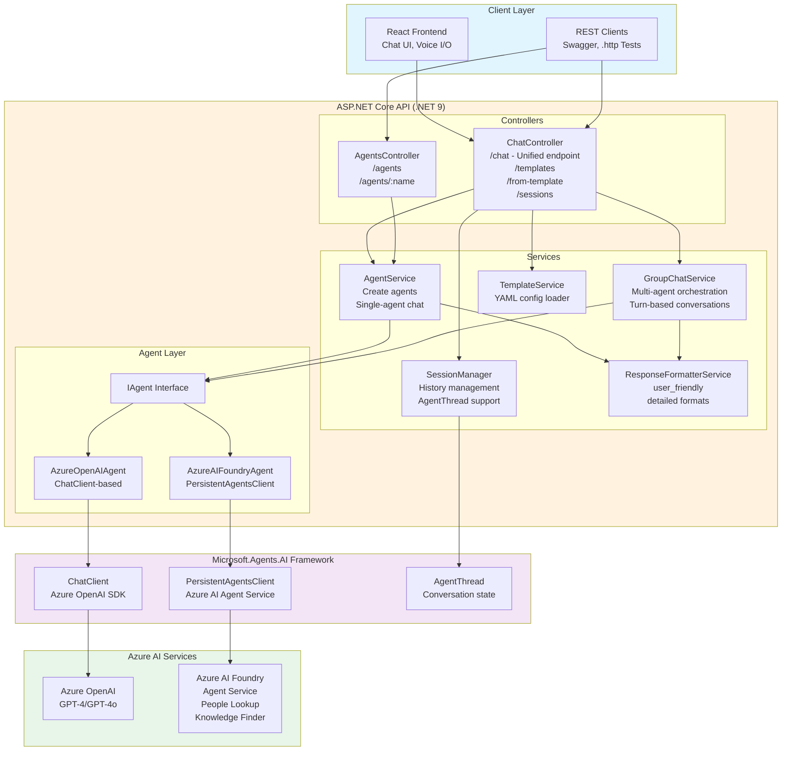
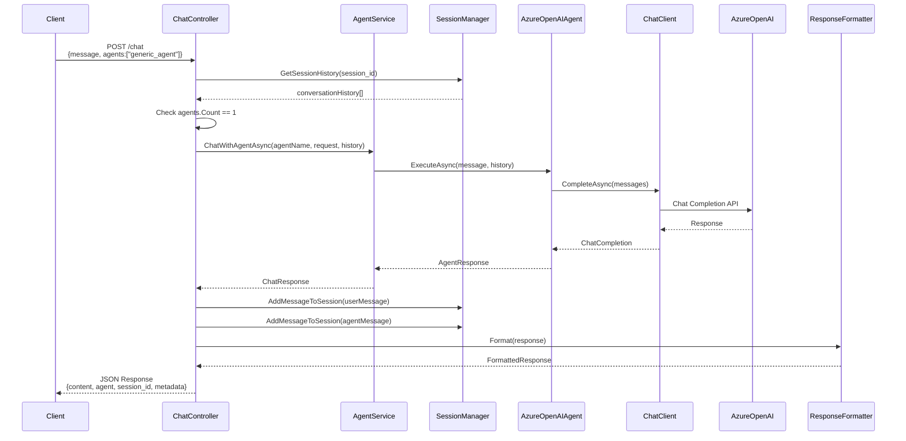
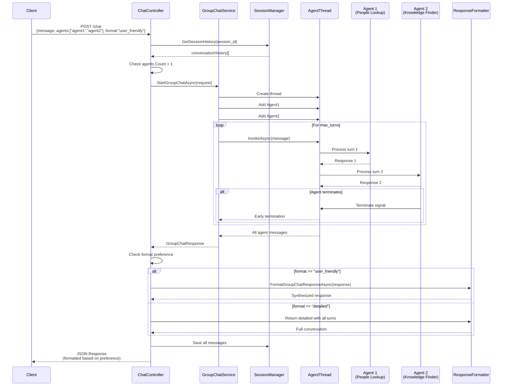
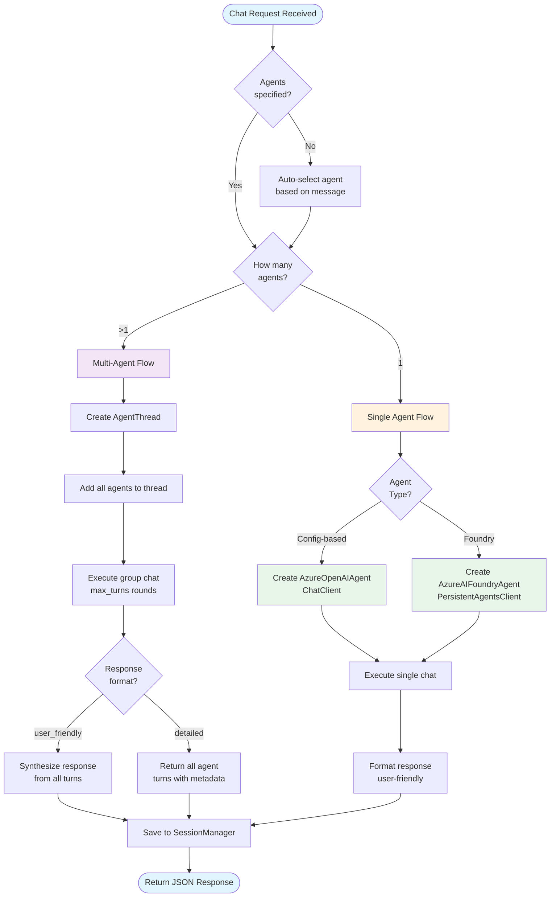

# .NET Agent Framework

A production-ready multi-agent orchestration framework built with .NET 9, ASP.NET Core, **Microsoft.Agents.AI Framework**, and Azure AI integration. This framework enables intelligent agent collaboration, conversation management, and flexible response formatting for complex AI-powered applications.

## 🌟 Features

- **Microsoft.Agents.AI Framework** - Built on Microsoft's official .NET AI agent framework with dual agent architecture
- **Unified Chat Endpoint** - Single `/chat` endpoint automatically handles both single-agent and multi-agent conversations
- **Multi-Agent Orchestration** - Coordinate multiple AI agents with intelligent turn-based conversations
- **Flexible Response Formats** - Choose between user-friendly synthesized responses or detailed conversation logs
- **Session Management** - Persistent conversation history across requests with AgentThread support
- **Agent Auto-Selection** - Automatic agent selection based on query intent when no agents specified
- **Template System** - Pre-configured chat templates for common single and multi-agent scenarios
- **Azure AI Integration** - Seamless integration with Azure AI Foundry and Azure OpenAI
- **Interactive Frontend** - React-based UI with voice input/output, markdown rendering, and real-time chat
- **RESTful API** - Well-documented API with Swagger UI and comprehensive .http test collection

## 🗺️ Architecture Diagrams

### High-Level System Architecture



### Request Flow - Single Agent



### Request Flow - Multi-Agent (Group Chat)



### Agent Type Decision Flow



> **Note**: These diagrams render automatically in GitHub and VS Code (with Mermaid extension). You can also export them to PNG/SVG at [mermaid.live](https://mermaid.live) for blog posts and presentations.

## 🚀 Quick Start

### Prerequisites

- **.NET 9 SDK** - [Download](https://dotnet.microsoft.com/download/dotnet/9.0)
- **Node.js 18+** - [Download](https://nodejs.org/)
- **Azure OpenAI** or **Azure AI Foundry** account
- **VS Code** with REST Client extension (optional, for testing)

### Backend Setup

1. **Navigate to backend directory:**
   ```powershell
   cd Backend\dotnet\agentframework
   ```

2. **Configure environment variables:**
   ```powershell
   # Copy template
   cp ..\..\env.template ..\..\env
   
   # Edit env file with your Azure credentials
   # Required: AZURE_OPENAI_ENDPOINT, AZURE_OPENAI_KEY, AZURE_OPENAI_DEPLOYMENT
   ```

3. **Restore dependencies:**
   ```powershell
   dotnet restore
   ```

4. **Run the API:**
   ```powershell
   dotnet run
   ```

   The API will start on:
   - **HTTP**: http://localhost:8000
   - **HTTPS**: https://localhost:51038
   - **Swagger UI**: http://localhost:8000

### Frontend Setup

1. **Navigate to frontend directory:**
   ```powershell
   cd frontend
   ```

2. **Install dependencies:**
   ```powershell
   npm install
   ```

3. **Start development server:**
   ```powershell
   npm start
   ```

   The UI will open at: http://localhost:3000

## 📡 API Endpoints

### Chat Endpoint (Unified)

**POST** `/chat`

Handles both single-agent and multi-agent conversations. The `/chat` endpoint automatically routes to multi-agent orchestration when multiple agents are specified.

**Request Body:**
```json
{
  "message": "Your question here",
  "agents": ["agent1", "agent2"],        // Optional: specific agents or null for auto-route
  "session_id": "unique-session-id",     // Optional: for conversation continuity
  "max_turns": 2,                        // Optional: max turns per agent (default: 2)
  "format": "user_friendly"              // Optional: "user_friendly" or "detailed"
}
```

**Response Formats:**

#### User-Friendly Format (Default)
Returns a clean, synthesized response:
```json
{
  "content": "Synthesized answer combining all agent insights...",
  "agent": "system",
  "session_id": "session-123",
  "timestamp": "2024-10-08T10:30:00Z",
  "format": "markdown",
  "metadata": {
    "agent_count": 3,
    "primary_agent": "PolicyAgent",
    "contributing_agents": ["PolicyAgent", "HRAgent", "ManagerAgent"],
    "is_group_chat": true,
    "total_turns": 6,
    "response_type": "user_friendly"
  }
}
```

#### Detailed Format
Returns full conversation history with all agent turns:
```json
{
  "conversation_id": "session-123",
  "total_turns": 6,
  "active_participants": ["PolicyAgent", "HRAgent", "ManagerAgent"],
  "responses": [
    {
      "agent": "PolicyAgent",
      "content": "Agent's response...",
      "message_id": "msg-1",
      "is_terminated": false,
      "metadata": {
        "turn": 1,
        "agent_type": "PolicyAgent",
        "timestamp": "2024-10-08T10:30:01Z"
      }
    }
    // ... more agent responses
  ],
  "summary": "Conversation summary",
  "content": "Final response",
  "metadata": {
    "group_chat_type": "sequential",
    "agent_count": 3,
    "response_type": "detailed"
  }
}
```

### Template & Session Endpoints

- **GET** `/agents` - List all available agents
- **GET** `/health` - Health check endpoint
- **GET** `/chat/templates` - List chat templates (single & multi-agent)
- **GET** `/chat/templates/{name}` - Get specific template details
- **POST** `/chat/from-template` - Create chat session from template
- **GET** `/chat/sessions` - List active chat sessions (both single and multi-agent)
- **GET** `/messages/{sessionId}` - Get session message history
- **POST** `/reset` - Reset session history
- **DELETE** `/messages/{sessionId}` - Delete session

## 🤖 Available Agents

| Agent | Type | Purpose | Use Cases |
|-------|------|---------|-----------|
| **generic_agent** | AzureOpenAI | General-purpose assistant | Technical questions, explanations, coding help |
| **foundry_people_lookup** | AzureAIFoundry | Find people and expertise | Employee search, skill matching, team discovery |
| **foundry_knowledge_finder** | AzureAIFoundry | Document and policy search | Policy questions, documentation lookup |
| **PolicyAgent** | Config-based | HR policy expert | Leave policies, conduct rules, compliance |

> **Note:** Foundry agents require Azure AI Foundry PROJECT_ENDPOINT and agent IDs. Generic agents work with Azure OpenAI only.

## 🎨 Frontend Features

### Format Selector
Toggle between response formats in the sidebar:
- **User Friendly** - Clean, synthesized responses (markdown formatted)
- **Detailed** - Full conversation with all agent turns and metadata

### Voice Integration
- **Voice Input** - Speech-to-text for hands-free message entry
- **Voice Output** - Text-to-speech for response playback
- Pause/resume controls during playback

### Multi-Agent Configuration
- Select multiple agents from dropdown
- Adjust max turns (1-5) for conversation depth
- Visual indicators for agent participation

### Message Display
- Markdown rendering with syntax highlighting
- Turn badges showing conversation flow
- Agent attribution for each response
- Timestamps and metadata

## 🧪 Testing

### Using REST Client (VS Code)

Open `Backend/dotnet/agentframework/DotNetAgentFramework.http` and click "Send Request" above any test:

```http
### Single Agent Chat
POST http://localhost:8000/chat
Content-Type: application/json

{
  "message": "What are best practices for .NET?",
  "agents": ["generic_agent"]
}

### Multi-Agent with User-Friendly Format
POST http://localhost:8000/chat
Content-Type: application/json

{
  "message": "Explain our leave policy",
  "agents": ["PolicyAgent", "HRAgent"],
  "max_turns": 2,
  "format": "user_friendly"
}

### Multi-Agent with Detailed Format
POST http://localhost:8000/chat
Content-Type: application/json

{
  "message": "Explain our leave policy",
  "agents": ["PolicyAgent", "HRAgent"],
  "max_turns": 2,
  "format": "detailed"
}
```

### Using Swagger UI

1. Navigate to http://localhost:8000
2. Expand `/chat` endpoint
3. Click "Try it out"
4. Modify request body
5. Click "Execute"

## 📚 Documentation

- **[Installation Guide](docs/INSTALL.md)** - Detailed setup instructions
- **[Getting Started](docs/START.md)** - Step-by-step tutorial
- **[AI Services Configuration](docs/AI_SERVICES.md)** - Azure AI setup
- **[Multi-Agent Orchestration](docs/GROUP_CHAT.md)** - Group chat guide
- **[Prompt Engineering](docs/PROMPTS.md)** - Agent instruction design

## 📧 Configuration

### Agent Configuration (`config.yml`)

```yaml
agents:
  - name: generic_agent
    model: gpt-4
    temperature: 0.7
    max_tokens: 1500
    instructions: |
      You are a helpful AI assistant...

  - name: PolicyAgent
    model: gpt-4
    temperature: 0.5
    instructions: |
      You are an HR policy expert...
```

### API Configuration (`appsettings.json`)

```json
{
  "AzureAI": {
    "Endpoint": "https://your-endpoint.openai.azure.com/",
    "DeploymentName": "gpt-4",
    "ApiKey": "your-api-key"
  },
  "Logging": {
    "LogLevel": {
      "Default": "Information"
    }
  }
}
```

## 🛠️ Development

### Project Structure

```
agentframework-workshop/
├── Backend/
│   └── dotnet/
│       ├── Controllers/          # API endpoints
│       ├── Services/             # Business logic
│       ├── Models/               # Data models
│       ├── Agents/               # Agent implementations
│       ├── Configuration/        # Config models
│       └── config.yml            # Agent definitions
├── frontend/
│   └── src/
│       ├── App.js                    # Main React component
│       ├── services/                 # API clients
│       └── components/               # UI components
└── docs/                             # Documentation
```

### Key Services

- **`ChatController`** - Unified chat endpoint with format handling
- **`AgentService`** - Agent lifecycle and execution management
- **`GroupChatService`** - Multi-agent orchestration
- **`ResponseFormatterService`** - Response formatting strategies
- **`SessionManager`** - Conversation history persistence
- **`AgentInstructionsService`** - Dynamic agent instruction loading

## 🚦 Response Format Details

### Format Selection Logic

```csharp
// Backend automatically detects format preference
if (request.Format?.ToLower() == "detailed") {
    // Return full conversation with all turns
    return DetailedResponse(groupResponse);
} else {
    // Return synthesized user-friendly response (default)
    return FormattedResponse(groupResponse);
}
```

### Frontend Format Handling

```javascript
// Frontend adapts rendering based on format
if (responseFormat === 'detailed' && response.responses) {
    // Display multiple messages with turn badges
    response.responses.forEach(resp => displayAgentMessage(resp));
} else {
    // Display single synthesized message
    displayMessage(response.content);
}
```

## 📊 Performance

- **Response Time**: 2-5 seconds for single agent
- **Multi-Agent**: 5-15 seconds (depends on max_turns and agent count)
- **Session Persistence**: In-memory with optional Redis backend
- **Concurrent Users**: Scales with ASP.NET Core async pipeline

## 🔐 Security

- HTTPS enabled by default
- CORS configured for frontend origin
- API key validation for Azure services
- Session isolation per user
- Request validation and sanitization

## 🤝 Contributing

1. Fork the repository
2. Create a feature branch (`git checkout -b feature/amazing-feature`)
3. Commit your changes (`git commit -m 'Add amazing feature'`)
4. Push to the branch (`git push origin feature/amazing-feature`)
5. Open a Pull Request

## 📄 License

This project is licensed under the MIT License.

## 🙋 Support

For issues, questions, or contributions:
- **GitHub Issues**: [Create an issue](https://github.com/nhcloud/agentframework-workshop/issues)
- **Documentation**: Check the `docs/` folder
- **Examples**: See `DotNetAgentFramework.http` for API examples

## 🎯 Roadmap

- [ ] Redis-backed session persistence
- [ ] Agent performance metrics dashboard
- [ ] Custom agent plugins system
- [ ] Streaming responses with SSE
- [ ] Multi-language support
- [ ] Advanced agent selection strategies
- [ ] Conversation export/import

---

Built with ❤️ using .NET 9, Microsoft.Agents.AI Framework, React, and Azure AI