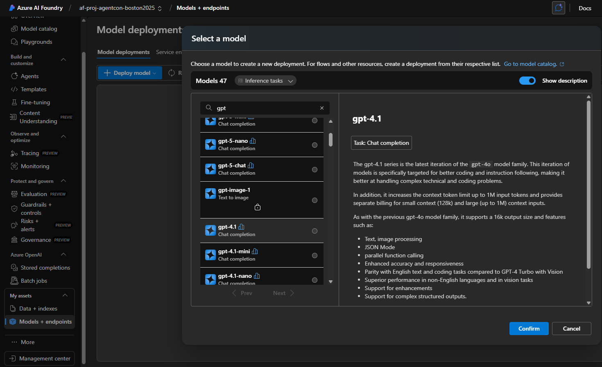
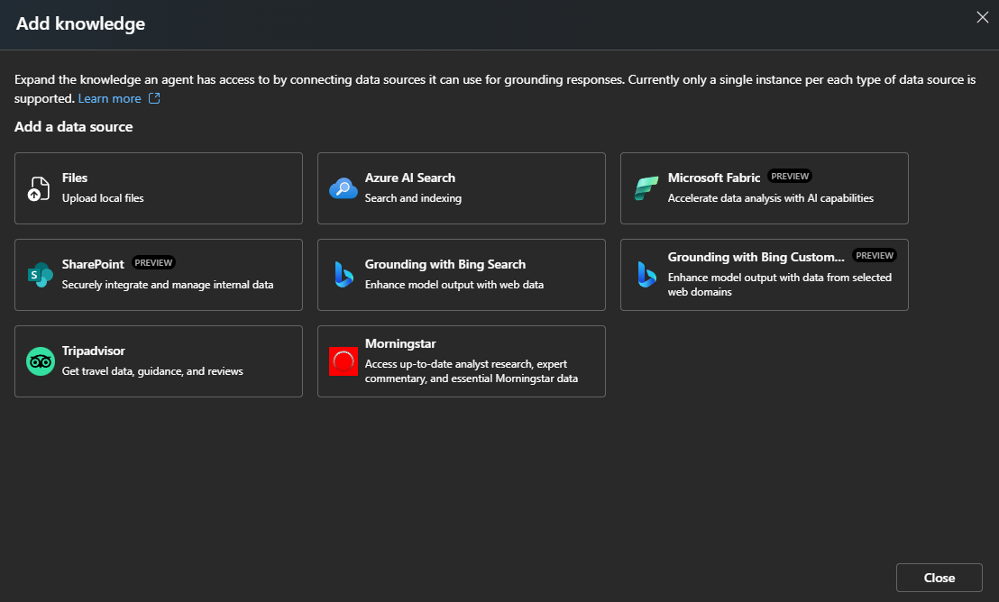

# Azure AI Services Setup Guide

This guide will walk you through setting up Azure AI Services for the AgentCon Workshop, including creating Azure AI Foundry and configuring agents.

## Prerequisites

- Azure subscription with appropriate permissions
- Access to create resource groups and AI services

## Step 1: Create Azure Resource Group

Create an Azure resource group, preferably in **EastUS** or **EastUS2** region for optimal performance.


## Step 2: Create User Managed Identity

Go to your Azure resource group, click "Add resource", then create a **User Managed Identity**.


## Step 3: Create Azure AI Foundry

Create **Azure AI Foundry** in your resource group.


Click **Create** to create Azure AI Foundry, and then navigate to the Azure AI Foundry resource you just created.


Click **"Go to Azure AI Foundry portal"**.

## Step 4: Configure Endpoints and Keys

Copy the **Key** you need to apply to your `.env` file from the Azure AI Foundry. Copy the **project endpoint**.


Click **AzureOpenAI** then copy the **Azure OpenAI endpoint**.


## Step 5: Deploy Model

From the left-hand side navigation, click **"Models + endpoints"**, then **Deploy Model "gpt-4.1"**.



You have now completed all required steps to run the "Generic Agent" using Azure OpenAI endpoint. Now let's create a couple of Azure Foundry Agents.

## Step 6: Create Employee Agent

Click **Agents** from the left-hand side, then click **"New agent"** or select the existing default agent.


From the right-hand side, change the **"Agent name"** to `Employee_Agent` and set the **instruction** to:

```
Employee Details and Communication Agent Ruleset:

Always search for real contact information:
When given a name (for email, call, or message), never use a default or example address. Always search all available resources (user-uploaded files, directories, databases, company intranet, etc.) for the actual contact information before taking any action.

No placeholder addresses:
Never send to example, generic, or fabricated emails or phone numbers (e.g., udai@example.com). If contact cannot be found after thorough search, ask the user for clarification.

Disambiguation:
If multiple contacts are found for the same name, select the top-ranked result according to the source's ordering. If there is a tie or ambiguity, ask the user to clarify which contact to use.

Confirm actions:
Clearly state to whom the message (or call) was sent, with the exact address or number found, and update the user on how the information was resolved.

Default to proactive search:
Never wait for the user to supply obvious details if you can resolve them via search. Assume responsibility for finding accurate information.

Citations:
When referencing found information, cite the exact resource or file used to resolve the contact detail.

Example:
If the instruction is "email John about the outage" and no email is specified, search the available resources for "John's" email immediately. Do not use john@example.com unless instructed directly. If not found, ask for clarification.
```

Then click **"Add"** from the knowledge section.



Select **Files**, then select **"Select local files"**.


Navigate to your repo root folder → `docs` → `sample-data` → `employees`, then select all 5 files and click **"Upload and save"**.


From the right side, scroll down and click **"Add"** after actions.


Then select **"Add Logic App action"**.


Then click **"Send email"**.  If you do not see this option then click **"Send Email using Outlook"**.


Click **"Next"** and then click **"Create"**.


Your final configuration will look like this:


Now click **"Try in playground"** from the right side to chat with your agent. Send an instruction like:
> "tell me about udai and email him that board needs to meet him on AI planning"

You will see something like:


**Congratulations!** Your first agent is working. **Note down the agentId** - we need to provide this in the `.env` file.

## Step 7: Create Company Policies Agent

Let's build another agent named **"Company_Policies_For_Employees"**.

From the left, click **Agents**, then **Add Agent**. From the right side set:

- **Agent Name**: `Company_Policies_For_Employees`
- **Instruction**: 
```
You are a useful agent who provides answers to company policy–related questions using the configured knowledge base. Do not use any information outside of the configured knowledge. Always try to find and return relevant information. If no result is found in the knowledge store, return: 'No result returned.'
```

Click **"Add"** after the knowledge section, select **"Files"**, from the next dialog select **"Select Local Files"**, then select files from `docs` → `sample-data` → `policies`. Once files are uploaded, click **"Upload and Save"** to complete the wizard.

Your final screen will look like this:


Now click **"Try in playground"** from the right menu (right above the agent ID), then send a prompt like:
> "what is the pto for newly joined employee"

You will get something similar to:


**Congratulations!** You have now completed the second agent that works with your private company policy documents. **Note down the AgentId**.

## Step 8: Environment Configuration

By now, you will have values for all the required environment variables:

```bash
# Python AI Agents Workshop - Environment Template
# Copy this file to .env and replace the placeholder values with your actual credentials

# ── Azure OpenAI ─────────────────────────────────────────
AZURE_OPENAI_ENDPOINT=https://your-resource-name.openai.azure.com
AZURE_OPENAI_API_KEY=your-azure-openai-api-key-here
AZURE_OPENAI_DEPLOYMENT_NAME=your-model-deployment-name
AZURE_OPENAI_API_VERSION="2024-02-01"

# ── Azure AI Foundry (existing project) ────────────────
PROJECT_ENDPOINT=https://your-resource-name.services.ai.azure.com/api/projects/your-project-name
PEOPLE_AGENT_ID=asst-your-people-agent-id-here
KNOWLEDGE_AGENT_ID=asst-your-knowledge-agent-id-here
MANAGED_IDENTITY_CLIENT_ID=your-user-managed-identity-client-id-that-has-access-to-foundry-ai

FRONTEND_URL=http://localhost:3001
```

## Step 9: Create Azure AI Content Safety (Recommended)

Azure AI Content Safety provides enterprise-grade content moderation for text and images across 4 categories: Hate, SelfHarm, Sexual, and Violence.

### Create Content Safety Resource

1. **Via Azure Portal:**
   - Go to Azure Portal
   - Click "Create a resource"
   - Search for "Azure AI Content Safety"
   - Select the resource and click "Create"
   - Choose your resource group and region (same as AI Foundry)
   - Select pricing tier (S0 recommended)
   - Click "Review + Create"

2. **Via Azure CLI:**
   ```bash
   az cognitiveservices account create \
     --name your-content-safety-name \
     --resource-group your-resource-group \
     --kind ContentSafety \
     --sku S0 \
     --location eastus
   ```

### Get Content Safety Credentials

1. Navigate to your Content Safety resource
2. Go to "Keys and Endpoint" section
3. Copy **Endpoint** URL
4. Copy **Key 1** or **Key 2**


### Add to Environment Variables

Update your `.env` file:

```bash
# ── Azure Content Safety (RECOMMENDED) ─────────────────
CONTENT_SAFETY_ENDPOINT=https://your-content-safety.cognitiveservices.azure.com/
CONTENT_SAFETY_API_KEY=your-content-safety-api-key-here
CONTENT_SAFETY_ENABLED=true
CONTENT_SAFETY_SEVERITY_THRESHOLD=4

# Per-category thresholds (0-7, or -1 to disable)
CONTENT_SAFETY_THRESHOLD_HATE=4
CONTENT_SAFETY_THRESHOLD_SELFHARM=4
CONTENT_SAFETY_THRESHOLD_SEXUAL=4
CONTENT_SAFETY_THRESHOLD_VIOLENCE=4

# Behavior configuration
CONTENT_SAFETY_BLOCK_UNSAFE_INPUT=true
CONTENT_SAFETY_FILTER_UNSAFE_OUTPUT=true

# Optional: Custom blocklists (comma-separated names)
CONTENT_SAFETY_BLOCKLISTS=

# Output filtering action (redact | placeholder | empty)
CONTENT_SAFETY_OUTPUT_ACTION=redact
CONTENT_SAFETY_PLACEHOLDER_TEXT=[Content removed due to safety policy]
```

### Create Custom Blocklists (Optional)

For industry-specific term blocking:

1. Visit [Azure Content Safety Studio](https://contentsafety.cognitive.azure.com/)
2. Sign in with your Azure account
3. Select your Content Safety resource
4. Navigate to "Blocklists" tab
5. Click "Create blocklist"
6. Add terms to block (one per line)
7. Save and copy the blocklist name to your `.env`

### Verify Content Safety Configuration

Test your setup using the frontend UI or API:

```bash
# Using curl
curl -X POST "http://localhost:8000/safety/scan-text" \
  -H "Content-Type: application/json" \
  -d '{"text": "Test message for safety scanning"}'
```

Expected response:
```json
{
  "isSafe": true,
  "highestSeverity": 0,
  "highestCategory": null,
  "categorySeverities": {
    "Hate": 0,
    "SelfHarm": 0,
    "Sexual": 0,
    "Violence": 0
  },
  "flaggedCategories": [],
  "blocklistMatches": []
}
```

### Content Safety Best Practices

✅ **Enable in Production** - Essential for public-facing applications
✅ **Set Appropriate Thresholds** - Default of 4 is balanced for most use cases
✅ **Use Blocklists** - Add industry-specific or company-specific terms
✅ **Monitor Logs** - Review flagged content to refine policies
✅ **Test Thoroughly** - Use the frontend testing panel before deployment

See [`CONTENT_SAFETY.md`](CONTENT_SAFETY.md) for comprehensive configuration guide.

## Complete Environment Configuration

Your final `.env` file should include:

```bash
# ── Azure OpenAI ────────────────────────────────────────
AZURE_OPENAI_ENDPOINT=https://your-resource-name.openai.azure.com
AZURE_OPENAI_API_KEY=your-azure-openai-api-key-here
AZURE_OPENAI_DEPLOYMENT_NAME=your-model-deployment-name
AZURE_OPENAI_API_VERSION="2024-02-01"

# ── Azure AI Foundry (existing project) ────────────────
PROJECT_ENDPOINT=https://your-resource-name.services.ai.azure.com/api/projects/your-project-name
PEOPLE_AGENT_ID=asst-your-people-agent-id-here
KNOWLEDGE_AGENT_ID=asst-your-knowledge-agent-id-here
MANAGED_IDENTITY_CLIENT_ID=your-user-managed-identity-client-id

# ── Azure Content Safety (RECOMMENDED) ─────────────────
CONTENT_SAFETY_ENDPOINT=https://your-content-safety.cognitiveservices.azure.com/
CONTENT_SAFETY_API_KEY=your-content-safety-api-key-here
CONTENT_SAFETY_ENABLED=true
CONTENT_SAFETY_SEVERITY_THRESHOLD=4
CONTENT_SAFETY_THRESHOLD_HATE=4
CONTENT_SAFETY_THRESHOLD_SELFHARM=4
CONTENT_SAFETY_THRESHOLD_SEXUAL=4
CONTENT_SAFETY_THRESHOLD_VIOLENCE=4
CONTENT_SAFETY_BLOCK_UNSAFE_INPUT=true
CONTENT_SAFETY_FILTER_UNSAFE_OUTPUT=true
CONTENT_SAFETY_BLOCKLISTS=
CONTENT_SAFETY_OUTPUT_ACTION=redact
CONTENT_SAFETY_PLACEHOLDER_TEXT=[Content removed due to safety policy]

FRONTEND_URL=http://localhost:3001
```

## Next Steps

Now move on to your choice of programming language to finish the second part of the workshop and call these agents from code:

- **Python**: Navigate to `Backend/python/` directory
- **.NET**: Navigate to `Backend/dotnet/` directory

Each backend implementation provides examples and notebooks to help you integrate with the Azure AI agents you've just created.

For detailed Content Safety documentation, see [`CONTENT_SAFETY.md`](CONTENT_SAFETY.md).